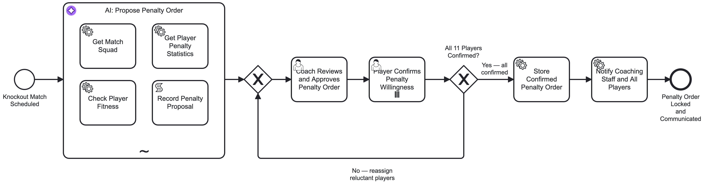
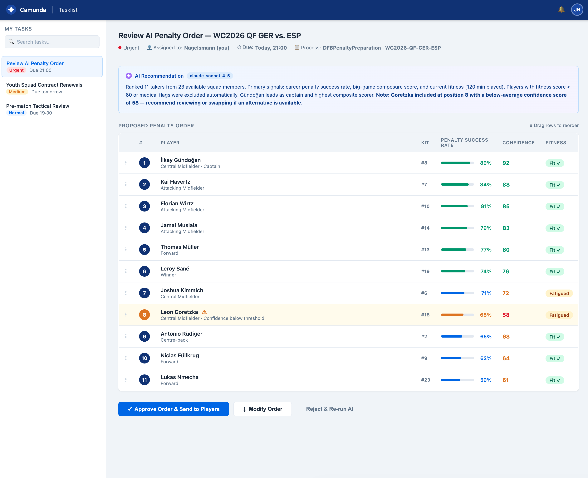
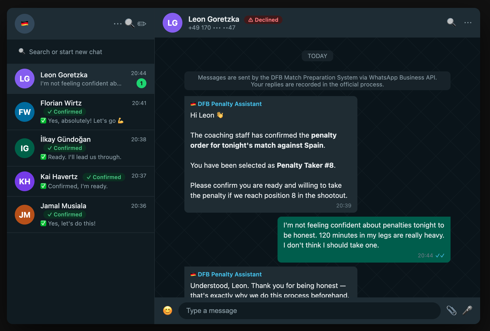

# DFB Penalty Preparation Process

A Camunda 8 process that uses an AI agent to ensure a national football team never enters a penalty shootout without a confirmed, fully ranked order of all 11 takers.

## Background

A few weeks ago, a major footballing nation was eliminated from the 2026 World Cup in a penalty shootout after a stunning breakdown in preparation. When a 6th penalty taker was needed at 3-3, four players stepped back. The captain asked one of them twice — twice he refused. A player who had never taken a professional penalty in his career stepped up because no one else would, and missed badly.

This is not a talent problem. It is a process problem.

## What it does



```
Start → AI Agent → Coach Review → Player Confirmation (×11 parallel) → Store & Notify → End
                        ↑                                                      │
                        └──────────────── No — reassign ───────────────────────┘
```

**1. AI Agent** (`bpmn:adHocSubProcess` with 4 tools)

Analyses the squad and proposes a fully ranked 11-player penalty order:

| Tool | What it does |
|------|-------------|
| `GetMatchSquad` | Lists all available players, positions, and on-field status |
| `GetPlayerPenaltyStatistics` | Retrieves career penalty stats and confidence score per player |
| `CheckPlayerFitness` | Checks real-time fatigue and medical flags (called for anyone >90 min played) |
| `RecordPenaltyProposal` | Commits the final ranked list with rationale |

Players with `fitnessScore < 60` or medical flags are excluded automatically.

**2. Coach Review** — The head coach sees the AI proposal with per-player rationale and can reorder or swap before approving.



**3. Player Confirmation** — Every player in the approved 11 receives a WhatsApp message simultaneously. They confirm yes or no. If anyone declines, the coach sees exactly who refused and loops back to reassign.



**4. Store & Notify** — The confirmed order is locked to the API and broadcast to the full coaching staff and all 11 takers. Everyone knows their number before they walk to the spot.

## Stack

- Camunda 8.8+
- AI Agent Sub-process connector (`io.camunda.connectors.agenticai.aiagent.jobworker.v1`)
- Anthropic Claude (`claude-sonnet-4-5`)
- REST connector for squad/stats/fitness API calls

## Prerequisites

- Camunda 8.8+ cluster (local via c8run or SaaS)
- [`c8ctl`](https://github.com/camunda/c8ctl) CLI configured with a profile
- Cluster secrets: `ANTHROPIC_API_KEY`, `DFB_API_KEY`

## Deploy

```bash
# Clone
git clone <this-repo>
cd dfb-process

# Deploy
c8ctl deploy dfb-penalty-preparation.bpmn --profile=<your-profile>
```

## Start a process instance

```bash
c8ctl create pi DFBPenaltyPreparation \
  --variable matchId='"WC2026-QF-GER-ESP"' \
  --variable coachUserId='"nagelsmann"' \
  --variable minutesPlayed=120
```

## Process variables

| Variable | Type | Description |
|----------|------|-------------|
| `matchId` | string | Match identifier, e.g. `"WC2026-QF-GER-ESP"` |
| `coachUserId` | string | Tasklist user ID of the head coach |
| `minutesPlayed` | number | Total minutes played including extra time |

## Modifying the AI prompt

The system and user prompts are in the `AgentProposePenaltyOrder` subprocess extension elements. To update them without re-applying the full template:

```bash
c8ctl element-template apply \
  -i io.camunda.connectors.agenticai.aiagent.jobworker.v1 \
  AgentProposePenaltyOrder \
  dfb-penalty-preparation.bpmn \
  --set 'data.systemPrompt.prompt=..."'
```

## Key design decisions

**All 11 positions, not just 5.** The agent's system prompt explicitly requires all 11 slots to be filled. Most teams prepare 5 takers; shootouts regularly go beyond that.

**Explicit player confirmation.** Willingness is confirmed in writing before the match, not assumed under pressure at 3-3.

**Loop on refusal.** If any player declines during the confirmation step, the process surfaces exactly who refused and returns to the coach for reassignment — before kickoff, not during the shootout.

**Fitness-aware ranking.** Players who have cramped, shown visible distress, or have medical flags after 120 minutes are automatically deprioritised, regardless of their penalty record.
